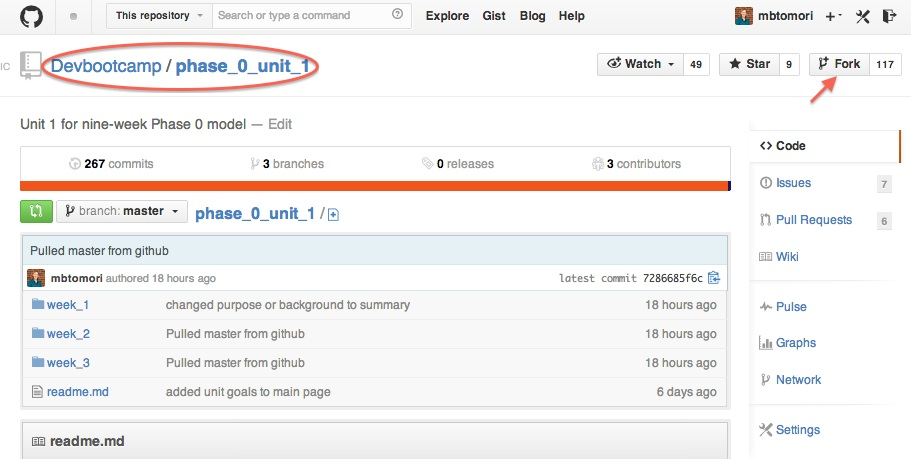
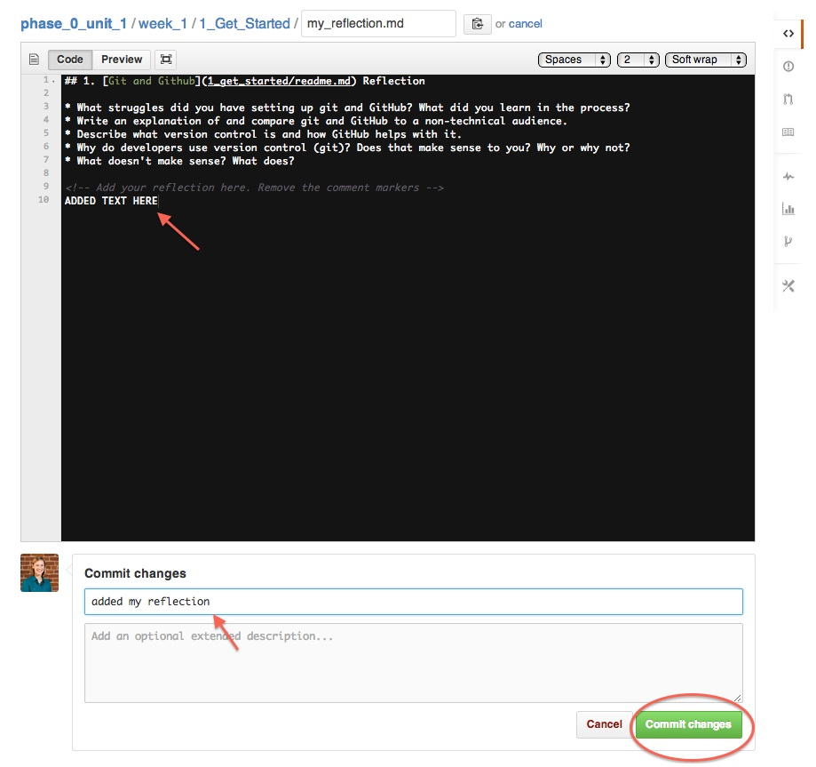

[Back](README.md)

# Git and GitHub 

## Learning Competencies
By the end of this lesson, you should be able to:

- Describe GitHub
- Compare git and GitHub
- Explain what version control is and does

## Releases 
(i.e. directions - each release is necessary for the next release, so be sure to do everything in the order specified for all challenges)

### Release 0: Sign up for GitHub

Have you signed up for [GitHub](http://www.github.com) yet? If not, [sign up here](http://www.github.com). Then follow [these instructions](https://help.github.com/articles/set-up-git) to install git and set up SSH keys. 

#### A. Username

I'm sure you've chosen an excellent and memorable username for GitHub, so don't forget it! When you see "[USERNAME]" in this guide, replace it with your username. For example, my username is "rmw".  So "github.com/**[USERNAME]**" becomes "github.com/**rmw**".

#### B. Install the GitHub App

Download the GitHub desktop application.

- [Mac](http://mac.github.com/)
- [Windows](http://windows.github.com/)

*Note: if you are using Linux, you'll need to use the command line for Git. We will have instructions for this later.*

### Release 1: Learn

#### What's this git stuff?

Go through the following resources to learn more about git and GitHub.

- Read: [Version Control](http://skillcrush.com/2013/02/11/version-control/)
- Do: [Try Git](https://try.github.io/) and/or [Git Immersion](http://gitimmersion.com/)
- Read Skillcrush's Git Series: [Git](http://skillcrush.com/2013/02/18/git/), [Getting Started with Git](http://skillcrush.com/2013/02/20/get-started-working-with-git/)
- Video: [Git 3 Minute Primer](http://www.youtube.com/watch?v=_Jmkvv_nKTE)

#### Git vs. GitHub

Confused about the difference between git and GitHub? Try one of these articles:

- [Git vs. GitHub for Dummies](http://stephaniehoh.github.io/blog/2013/10/07/git-vs-github-for-dummies/)
- [Is Git the same as GitHub?](http://www.jahya.net/blog/?2013-05-git-vs-github)

### Release 2: Reflection
Reflecting is essential for solidifying your learning. You will be expected to complete a reflection for each challenge in Phase 0. It will help you learn how you learn, give opportunities for sharing resources, and help your instructors gauge your progress. Reflections are for you, but they will also be read by others, so make sure to write for an audience. 

**Writing reflections for each challenge is mandatory.**

Before you can complete your reflection, you'll need to click the "Fork" button at the top right of this page. You will write all of your reflections, and most of your challenges (after weeks 1 and 2) in your unit-specific repositories. DO NOT move your reflections into your [USERNAME].github.io repository. These are separate. 

This will make a copy of the unit 1 curriculum repository into your personal GitHub account. This will be where you add reflections and later solutions. After you click fork, you should be taken from the Devbootcamp.com/phase_0_unit_1 repo to [USERNAME]/phase_0_unit_1

Reflect on your learning by editing the my_reflection.md file in the [1_get_started](./) folder (the folder you are in). You will be learning HTML this week, but these files have a `.md` extension. Do you know what that stands for? It stands for markdown, which is a text-to-HTML conversion tool.  If you would rather write in HTML, you can do that by changing the file extension from .md to .html. 

You can complete the first 2 challenge reflections on github.com. Click on the my_reflection.md file in this folder. There should be a button to edit at the top. Click it. You'll add your reflection in markdown and write a commit message under "Commit changes". Once you type something there, you will want to click the "commit changes" button. **NOTE: It will not let you commit changes without a commit message.**

After you learn how to edit files locally and sync/push your changes (in the third challenge), you'll want to edit all files on your local `phase_0_unit_1` repository--more on that later. 

