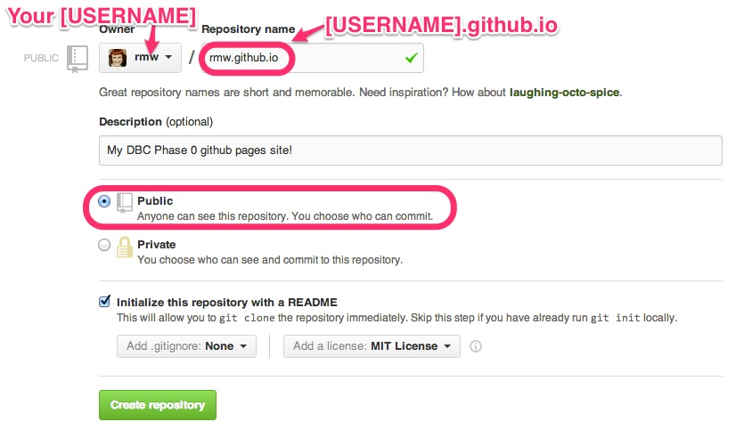
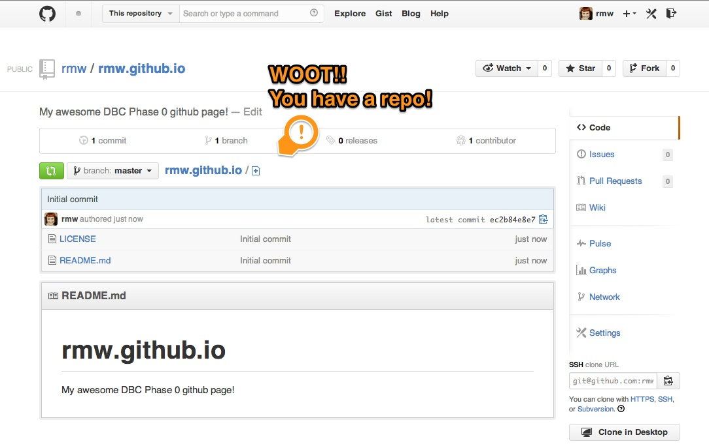

[Back](README.md)

# Set up a repository

We are going to create a repository to host your very own website! You'll be using a GitHub repository and [GitHub Pages](http://pages.github.com/) to set it up.

## Learning Competencies

- Explain how to create a repository on GitHub and clone a repository to your local computer
- Describe "open source"
- Assess the importance of using licenses 

## Release 0: Create a website repository

1. **Log into GitHub**
2. **Create a [new repository](https://github.com/new) **  This will take you to the new repository form.  
3. **Fill out the new repository form.** <ul><li>You *must, must, must* name your repository **[USERNAME].github.io**.</li><li>Your repository should be *public*.  </li><li>Check "Initialize this project with a README" and add an MIT license. </li></ul>  I'm gonna say it again: You *must, must, must* name your repository **[USERNAME].github.io**. If you have trouble, double check you spelled it right. 
4. Click on the **"Create Repository" button**
5. Click on **settings** on the "Features" section, add a check next to "Issues." This will allow others to give you feedback on your site!
6. **Do a celebration dance!**  :dancers: :tada: :dancer:   

## Release 1: Download the repository

A git repository is "distributed", which means it exists on many computers instead of just one.  Right now your repository exists on GitHub, but in order to add or edit files, you need it to exist on *your computer*.

In git terms, this is called **cloning a repository locally**. A "local repository" is the copy on your computer. A "remote repository" is one on another server, i.e. on GitHub, or on another person's computer.  

#### Clone a repository with the GitHub App

For [Mac](http://mac.github.com/) and [Windows](http://windows.github.com/) users, open the GitHub app you installed earlier.

If you are working on Linux and/or want to challenge yourself further, skip to the next section.

1. Open the GitHub App
2. On the right side bar, click on your github [USERNAME]
3. In the search bar, start searching for "github".  Your "[USERNAME].github.io" repository should come up in the list.
4. Click on the "Clone to this computer" button.

#### Cloning a repository with the command line

This section is for Linux users or those who want to challenge themselves.  Later in DBC and in your life as a professional developer, you will use git and access GitHub using the command line (aka "terminal").

Use [this tutorial](../git_clone.md) to clone your repository on the command line.

## Release 2: Open Source

You added an MIT License to your repository.  Read these articles to explain why:

* [Open Source](http://skillcrush.com/2012/08/29/open-source-software/) 
* [Open Source licensing](http://www.slideshare.net/CodeMontage/writespeakcode-open-source-licenses) 
* [A short guide to Open Source](http://www.smashingmagazine.com/2010/03/24/a-short-guide-to-open-source-and-similar-licenses/)

## Release 3: Reflect

Reflect on your learning by editing the my_reflection.md file in the [2_set_up_repo](./) folder (the folder you are in). Please answer to the questions in the file. 

You can complete the first 2 challenge reflections on github.com. Click on the my_reflection.md file in this folder. There should be a button to edit at the top. Click it. You'll add your reflection in markdown and write a commit message under "Commit changes". Once you type something there, you will want to click the "commit changes" button. **NOTE: It will not let you commit changes without a commit message.**
